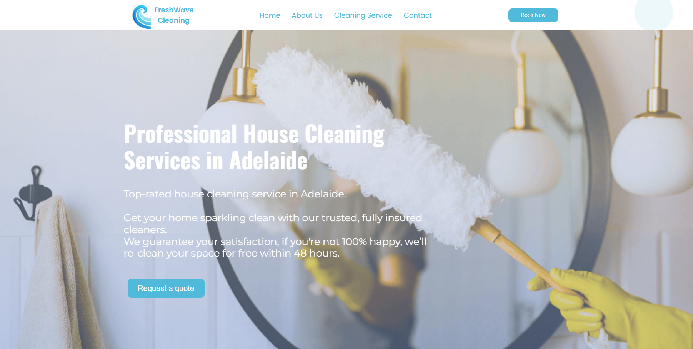
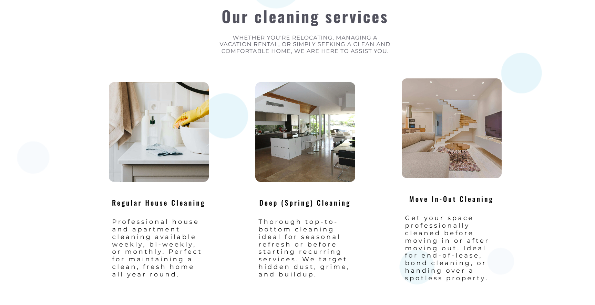
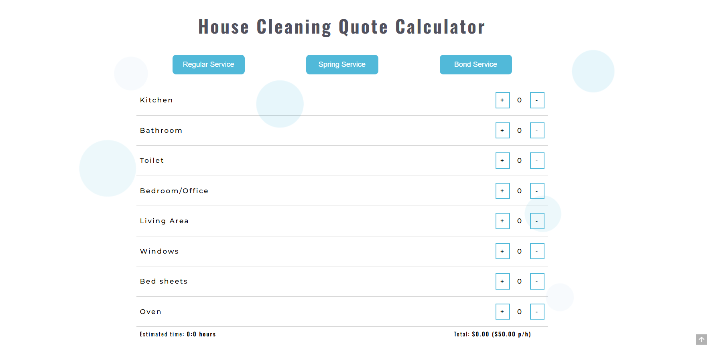
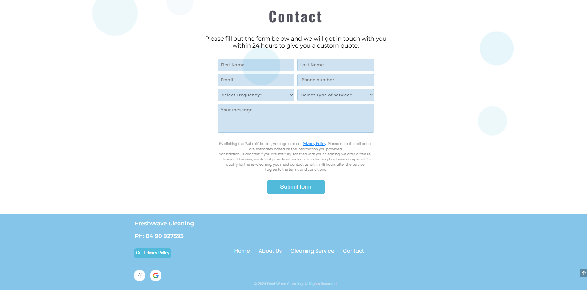
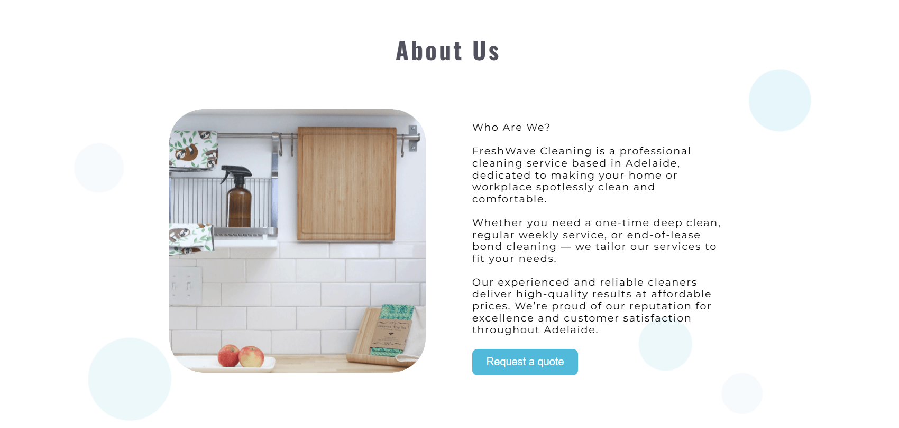
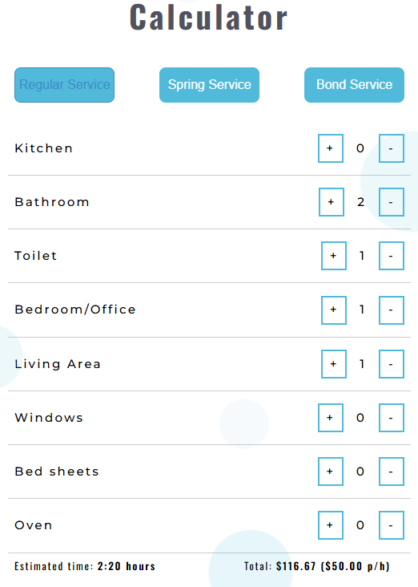

# FreshWave Cleaning Website

> ⚠️ **Commercial Project**
>
> This repository showcases the project, technologies used, and my contribution.
> The source code is private due to commercial confidentiality.

Production business website developed for a cleaning company, featuring an interactive quote calculator, SEO optimisation, and online lead generation.

## 🌐 Live Website

https://freshwavecleaning.au

---

## 📌 Project Information

**Project Type:** Commercial Business Website

**Status:** Live Production

**Role:** Sole Full-Stack Developer

**Frontend:** React • TypeScript • Styled Components • CSS

**Email Service:** EmailJS

**Hosting:** Hostinger

**Analytics:** Google Analytics

**Marketing:** Google Ads

## ⭐ Highlights

- Production website used by a real business
- Supports active Google Ads campaigns
- Interactive pricing calculator
- SEO-optimised for lead generation
- Fully responsive across desktop and mobile devices
---

# Overview

FreshWave Cleaning Website is a production website developed for a professional cleaning company.

The primary goal of the project was to create a modern, high-converting website capable of generating qualified leads through Google Ads while providing potential customers with transparent pricing before requesting a quote.

A key feature of the website is an interactive cleaning cost calculator that estimates both pricing and cleaning duration based on user selections.

The website is actively used by the business and serves as its primary online presence and customer acquisition platform.

---

# Business Goals

- Generate new customer enquiries
- Support Google Ads campaigns
- Improve customer trust
- Provide instant price estimates
- Reduce low-quality enquiries
- Create a modern online presence

---

# Features

- Responsive design
- Interactive quote calculator
- Automatic cleaning time estimation
- Automatic price estimation
- Multiple cleaning service options
- Online booking enquiry form
- SEO optimisation
- Responsive image optimisation
- Google Analytics integration
- Google Ads integration
- Mobile-friendly interface

---

# Tech Stack

### Frontend

- React
- TypeScript
- Styled Components
- CSS
- JavaScript

### Services

- EmailJS

### Hosting

- Hostinger

### Marketing

- Google Analytics
- Google Ads

---

# My Contribution

I was responsible for the complete software development of the project, including:

- Frontend architecture
- Responsive website development
- Interactive quote calculator
- Business logic implementation
- Email integration
- SEO implementation
- Performance optimisation
- Responsive image loading
- Google Analytics integration
- Google Ads integration
- Production deployment

The visual design was developed collaboratively, while I was responsible for the complete software implementation.

---

# Engineering Challenges

The project involved several real-world engineering challenges, including:

- Developing an interactive pricing calculator with dynamic business logic
- Creating a responsive user experience across desktop and mobile devices
- Optimising performance through responsive image loading
- Implementing SEO best practices for organic search visibility
- Preparing the website for Google Ads campaigns and lead generation
- Deploying and maintaining a production website used by real customers

---

# Screenshots

## 🏠 Home Page

---

## 🧹 Services

---

## 💰 Interactive Price Calculator

---

## 📝 Booking Form

---

## 👋 About Us

---

## 📱 Mobile Home

---

## 📱 Mobile Price Calculator

---

# Results

The website is currently used as the company's primary online platform.

It supports active Google Ads campaigns, provides customers with instant pricing estimates, and generates enquiries through the integrated contact form.

---

# Note

This repository contains project documentation and screenshots only.

The source code is intentionally kept private due to commercial confidentiality.
